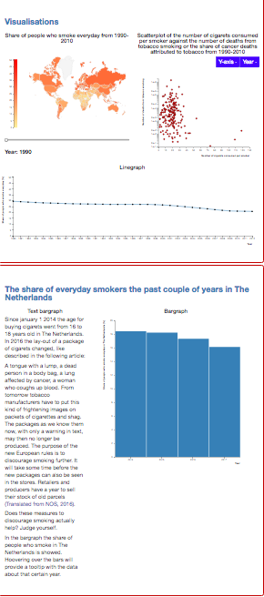

[programming project](https://jacobjjasper.github.io/programmeer_project/index.html)
[Tutorial](https://youtu.be/lo_mQOMuI8U)

##Project information
- Name project: FACT: Smoking kills

- Purpose: discouraging people between 14-30 years old to smoke or make stop smoking
- Name student: Jacob Jasper
- Copyright (c) 2018 jacobjjasper

##Sources
- http://bl.ocks.org/darrenjaworski/5397362
- http://datamaps.github.io/
- https://maxcdn.bootstrapcdn.com/bootstrap/3.3.7/css/bootstrap.min.css
- https://ajax.googleapis.com/ajax/libs/jquery/3.3.1/jquery.min.js
- https://maxcdn.bootstrapcdn.com/bootstrap/3.3.7/js/bootstrap.min.js
- //cdnjs.cloudflare.com/ajax/libs/d3/3.5.3/d3.min.js
- https://www.verywellmind.com/global-smoking-statistics-for-2002-2824393
- https://nos.nl/artikel/2105852-nieuwe-regels-voor-sigarettenpakjes-gruwelijke-plaatjes.html
- https://ourworldindata.org/smoking#deaths-from-smoking
- https://opendata.cbs.nl/statline/#/CBS/nl/dataset/83021NED/table?dl=856C
