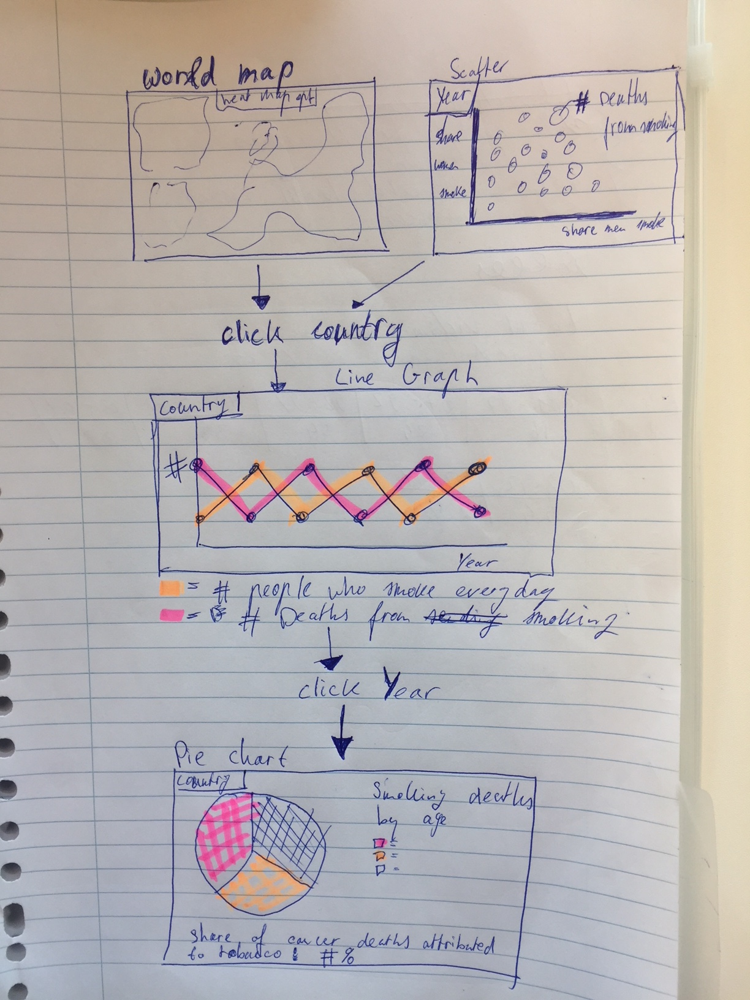

# Project proposal

## Student information
- Name: Jacob Jasper
- Student number: 10650385
- Subject: Programming project

## Problem statement

 With the internet the information about the negative effects of smoking are
 easy to find. Even with all this information people still smoke. But how
 much people are actually still smoking compared to the past? Is the total amount
 of smokers (and deaths by smoking) reducing? (target audience: 12-30 years)

## Solution

Let people visualize the horrible effects of smoking so they won't start smoking.

- There is a world map and a scatterplot. Both you can select a country.
- Scatter shows share men set against share women who smoke.
- Click a country you get a line graph of the years 2000-2015.
- Click a year and you get a pie chart of the smoking deaths by age.
- Underneath the pie chart there will be a percentage of cancer deaths attributed
to tobacco.
- Optional: Heatmap to the world map.

## Prerequisites

- Datasources: https://ourworldindata.org/smoking#smoking-and-cancer
- External components: D3-tip, D3 and Bootstrap.
- Similar: At the website of my datasource there are a lot of visualisations. I think
that I will implement the world graph and scatter the same way. The line graph and
pie chart will be really basic so that the user will understand it easy.
- Hardest parts: I have so much data, how do I process this in an ordered and
structured way and link them to each other. Are the datasets exactly the same order
of countries or do I have to order them by myself. I think that is the hardest part.
